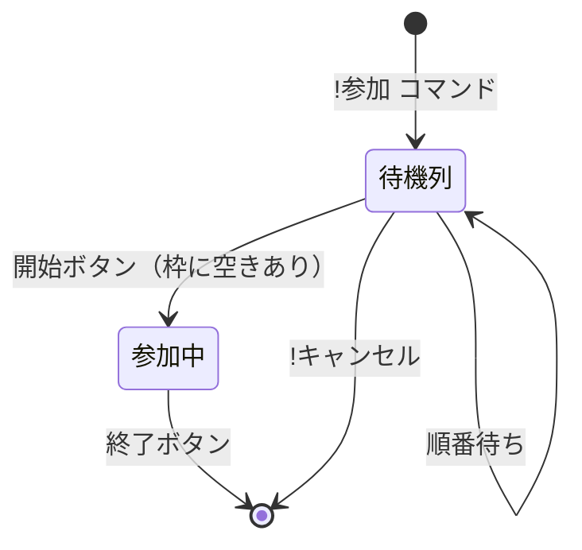

# システム仕様書

## 概要

Twitch配信用の汎用参加者管理オーバーレイシステム。
視聴者がコメントで参加希望を出し、配信者が参加者を管理する。

**対象ゲーム例**:
- 対戦格闘ゲーム（1v1、チーム戦）
- バトロワ系（スクワッド募集）
- パーティゲーム（複数人参加）
- その他、視聴者参加型の配信全般

## ユースケース

```
┌─────────────────────────────────────────────────────────────┐
│                      配信画面                               │
│  ┌─────────────────────────────────────────────────────┐   │
│  │                                                     │   │
│  │                  ゲーム画面                          │   │
│  │                                                     │   │
│  └─────────────────────────────────────────────────────┘   │
│                                                             │
│  ┌──────────────────┐    ┌──────────────────────────────┐  │
│  │   参加中 (N人)    │    │         待機列              │  │
│  │  ┌────┐ ┌────┐   │    │  5. user_e                  │  │
│  │  │ 1  │ │ 2  │   │    │  6. user_f                  │  │
│  │  │userA│ │userB│   │    │  7. user_g                  │  │
│  │  └────┘ └────┘   │    │  ...                        │  │
│  │  ┌────┐ ┌────┐   │    │                              │  │
│  │  │ 3  │ │ 4  │   │    │                              │  │
│  │  │userC│ │userD│   │    │                              │  │
│  │  └────┘ └────┘   │    │                              │  │
│  └──────────────────┘    └──────────────────────────────┘  │
└─────────────────────────────────────────────────────────────┘
```

## 参加フロー



## 状態管理

### 受付状態

| 状態 | 説明 |
|------|------|
| OPEN | 参加受付中（`!参加` 有効） |
| CLOSED | 受付停止（`!参加` 無視） |

### 参加者状態

| 状態 | 説明 |
|------|------|
| WAITING | 待機列で順番待ち |
| ACTIVE | 参加中 |

## 機能仕様

### 1. 参加受付

**トリガー**: Twitchチャットで `!参加` コマンド

**処理**:
1. ユーザー名を抽出
2. 重複チェック（既に参加済みなら無視）
3. 待機列の上限チェック（20人超えなら通知）
4. 待機列の末尾に追加
5. 順番を割り当て

**表示**: 待機列に「順番. ユーザー名」形式で表示

### 2. 参加キャンセル

**トリガー**: Twitchチャットで `!キャンセル` コマンド

**処理**:
1. ユーザー名を抽出
2. 待機列に存在するか確認
3. 存在すれば削除、後続の順番を繰り上げ
4. 存在しなければ無視

**注意**: 参加中のユーザーはキャンセル不可

### 3. 参加開始

**トリガー**: MIDIコントローラーの「開始」ボタン

**処理**:
1. 待機列から先頭N人を取り出し（Nは設定可能）
2. 参加中エリアに移動

**表示**: 参加中エリアにN人を表示

### 4. 参加終了

**トリガー**: MIDIコントローラーの「終了」ボタン

**処理**:
1. 参加中の全員を削除
2. 待機列の順番を繰り上げ

**表示**: 参加中エリアをクリア、待機列を更新

### 5. 参加受付ON/OFF

**トリガー**: MIDIコントローラーの「受付切替」ボタン

**処理**:
- ON: `!参加` コマンドを受け付ける
- OFF: `!参加` コマンドを無視

**タイムアウトなし**: 配信者が手動でOFFにするまで受付継続

### 6. 手動削除（オプション）

**トリガー**: MIDIコントローラーの「削除」ボタン

**処理**: 指定した参加者を待機列/参加中から削除

## 設定項目

| 項目 | デフォルト | 説明 |
|------|------------|------|
| 参加枠数 | 4 | 1回に参加できる人数 |
| 待機列上限 | 20 | 待機列の最大人数 |
| 参加コマンド | `!参加` | 参加用コマンド |
| キャンセルコマンド | `!キャンセル` | キャンセル用コマンド |

## データ構造

### 参加者テーブル (Table COMP)

| index | username | status | joined_at |
|-------|----------|--------|-----------|
| 1 | user_a | WAITING | 12:00:00 |
| 2 | user_b | WAITING | 12:00:05 |
| 3 | user_c | ACTIVE | 12:00:10 |
| ... | ... | ... | ... |

## MIDIコントローラー割り当て

| ボタン | 機能 | 備考 |
|--------|------|------|
| Button 1 | 開始 | 待機列→参加中 |
| Button 2 | 終了 | 参加中をクリア |
| Button 3 | 受付ON/OFF | トグル動作 |
| Button 4 | 待機列クリア | オプション |

## UI仕様

### 参加中エリア

- 設定した枠数分を表示
- 各枠に「順番」と「ユーザー名」
- 背景透過（OBSでゲーム画面に重ねる）

### 待機列エリア

- 縦リスト形式
- 表示件数: 5〜10人程度（スクロールなし）
- 「順番. ユーザー名」形式

### デザイン要件

- 視認性の高いフォント
- ゲーム画面を邪魔しない配置
- 背景は半透明または完全透過

## 技術構成

```
┌─────────────────────────────────────────────────────────────┐
│                     TouchDesigner                           │
│                                                             │
│  ┌─────────────┐    ┌─────────────┐    ┌─────────────┐     │
│  │   Twitch    │    │    MIDI     │    │   State     │     │
│  │    Chat     │───▶│  Controller │───▶│  Manager    │     │
│  │  Component  │    │    CHOP     │    │  (Python)   │     │
│  └─────────────┘    └─────────────┘    └──────┬──────┘     │
│         │                                      │            │
│         ▼                                      ▼            │
│  ┌─────────────┐                       ┌─────────────┐     │
│  │   Filter    │                       │   Table     │     │
│  │  (!参加)    │──────────────────────▶│    COMP     │     │
│  └─────────────┘                       └──────┬──────┘     │
│                                               │            │
│                                               ▼            │
│                                        ┌─────────────┐     │
│                                        │  Overlay    │     │
│                                        │     UI      │     │
│                                        └──────┬──────┘     │
│                                               │            │
│                                               ▼            │
│                                        ┌─────────────┐     │
│                                        │   Spout     │     │
│                                        │   Output    │     │
│                                        └─────────────┘     │
└───────────────────────────────────────────────┼─────────────┘
                                                │
                                                ▼
┌─────────────────────────────────────────────────────────────┐
│                          OBS                                │
│  ┌─────────────┐    ┌─────────────┐    ┌─────────────┐     │
│  │    Game     │  + │   Overlay   │  = │   Output    │     │
│  │   Capture   │    │   (Spout)   │    │   Stream    │     │
│  └─────────────┘    └─────────────┘    └─────────────┘     │
└─────────────────────────────────────────────────────────────┘
```

## 再参加ルール

### 終了後の再参加

- **すぐに再参加可能**
- 終了後、同じユーザーが `!参加` で待機列に並べる

### 重複コマンドの処理

- **無視**（順番維持）
- 既に待機列 or 参加中のユーザーが `!参加` → 何も起こらない

```
ユーザーA: !参加  → 待機列に追加（5番目）
ユーザーA: !参加  → 無視（5番目のまま）
　　↓ 終了
ユーザーA: !参加  → 待機列に追加（新しい順番）
```

## 待機列の制限

### 最大人数

- **20人**まで（設定で変更可能）

### 上限到達時の動作

- `!参加` に対して **メッセージ通知**
- 例: 「現在満員です。しばらくお待ちください」

## 未決定事項

- [ ] 戦績の記録（将来機能）

## 次のステップ

1. 環境構築（001_initial）
2. Twitchチャット接続（002_twitch_chat）
3. MIDIコントローラー接続テスト
4. UIプロトタイプ作成
5. 統合テスト

## 実験ログ

（実験結果をここに追記）

## 結論

（完了時に記入）
